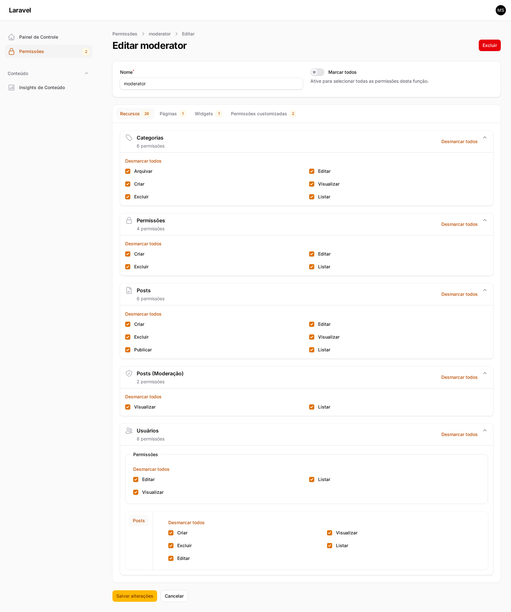

# Filament ACL

[](https://packagist.org/packages/coringawc/filament-acl)
[](https://github.com/coringawc/filament-acl/actions?query=workflow%3Arun-tests+branch%3Amain)
[](https://github.com/coringawc/filament-acl/actions?query=workflow%3A%22Fix+PHP+code+styling%22+branch%3Amain)
[](https://packagist.org/packages/coringawc/filament-acl)

`coringawc/filament-acl` is a Filament v4 or v5 plugin for permission systems that are driven by `Resource`, `RelationManager`, `Page`, and `Widget` ownership instead of model-derived subjects.

It was designed for complex panels where the same Eloquent model can appear in many different UI contexts and each context may need a different permission namespace.

## What It Solves

- Permissions are scoped by Filament owner, not by model class.
- A single model can back many resources without forcing duplicated models or policies.
- Policies can keep using Laravel's native signatures and still receive the Filament permission owner as an extra argument.
- Resources, relation managers, pages, widgets, and custom permissions can all participate in the same permission graph.
- Protected roles such as `super_admin` can be hidden from UI and optionally bypass package-level checks.
- The package ships with an optional built-in roles and permissions resource.

## Screenshot



## Core Principles

- Trait-first. No `BaseResource` or `BaseRelationManager` is required.
- Automatic by default. Override methods only when the default subject or ownership is not enough.
- Policy-first. Custom actions continue using Laravel `can()` and Filament `->authorize()`.
- Generic. The package does not depend on `filament-shield`.
- Spatie-compatible. Roles and permissions are stored through `spatie/laravel-permission`.

## Requirements

- PHP 8.4+
- Laravel 12+
- Filament v4 and v5
- Spatie Laravel Permission

## Installation

Install the package:

```bash
composer require coringawc/filament-acl
```

The quickest setup is the install command:

```bash
php artisan filament-acl:install --panel=admin --migrate --sync --with-admin-user
```

What the install command does:

- publishes `config/permission.php` when it does not already exist
- publishes `config/filament-acl.php`
- publishes the permission migration stub
- detects whether your user model uses `uuid`, `ulid`, `string`, or integer morph keys
- writes that morph-key type into the published package config
- optionally runs migrations
- optionally syncs permissions
- optionally creates or promotes an admin user with the protected role

If config or migration files already exist, the command will not overwrite them silently unless you pass `--force`.

### Manual Publishing

If you prefer the manual route:

```bash
php artisan vendor:publish --tag="permission-config"
php artisan vendor:publish --tag="filament-acl-config"
php artisan vendor:publish --tag="filament-acl-migrations"
php artisan vendor:publish --tag="filament-acl-stubs"
```

Then migrate and sync:

```bash
php artisan migrate
php artisan filament-acl:sync --panel=admin --with-protected-role
```

## Registering The Plugin

Register the plugin once on each panel:

```php
<?php

use CoringaWc\FilamentAcl\FilamentAclPlugin;
use Filament\Panel;

public function panel(Panel $panel): Panel
{
    return $panel
        ->plugin(
            FilamentAclPlugin::make()
                ->scopeRolesByPanel()
                ->scopePermissionsByPanel()
        );
}
```

Useful plugin methods:

- `strictMode(bool $condition = true)`
- `scopeRolesByPanel(bool $condition = true)`
- `scopePermissionsByPanel(bool $condition = true)`
- `permissionsResource(bool $condition = true)`
- `permissionsResourceNavigationLabel(?string $label)`
- `permissionsResourceNavigationIcon(string|\BackedEnum|\Illuminate\Contracts\Support\Htmlable|null $icon)`
- `permissionsResourceNavigationGroup(string|\UnitEnum|null $group)`
- `permissionsResourceNavigationSort(?int $sort)`
- `permissionsResourceModelLabel(?string $label)`
- `permissionsResourcePluralModelLabel(?string $label)`
- `permissionsResourceManagedPanel(string|\BackedEnum|null $panel)`
- `permissionsResourceCluster(?string $cluster)`
- `configurePermissionsResource(Closure $callback)`

## Opting In Owners

When `filament-acl.integration.require_explicit_opt_in` is `true`, only classes that opt in through the package traits participate in:

- permission syncing
- permission resource discovery
- runtime permission checks

### Resource

```php
<?php

use CoringaWc\FilamentAcl\Resources\Concerns\HasResourcePermissions;
use Filament\Resources\Resource;

class PostResource extends Resource
{
    use HasResourcePermissions;
}
```

### Relation Manager

```php
<?php

use CoringaWc\FilamentAcl\RelationManagers\Concerns\HasRelationManagerPermissions;
use Filament\Resources\RelationManagers\RelationManager;

class PostsRelationManager extends RelationManager
{
    use HasRelationManagerPermissions;
}
```

#### Delegating To A Related Resource

By default, each relation manager maintains its own permission set. If you prefer that a relation manager delegates authorization to a related resource instead:

```php
// config/filament-acl.php
'relation_managers' => [
    'delegate_to_related_resource_by_default' => true,
],
```

When enabled, a relation manager that defines a related resource will use that resource's permissions instead of generating its own. Individual relation managers can override this per-class:

```php
public static function shouldUseRelatedResourcePermissions(): bool
{
    return false; // keep own permissions even when the global default is true
}
```

### Page

```php
<?php

use CoringaWc\FilamentAcl\Pages\Concerns\HasPagePermissions;
use Filament\Pages\Page;

class ContentInsightsPage extends Page
{
    use HasPagePermissions;
}
```

### Widget

```php
<?php

use CoringaWc\FilamentAcl\Widgets\Concerns\HasWidgetPermissions;
use Filament\Widgets\Widget;

class PostsOverviewWidget extends Widget
{
    use HasWidgetPermissions;
}
```

## Automatic Subjects

`getPermissionSubject()` is optional.

By default, the package builds subjects automatically from the Filament owner class, for example:

- `PostResource` -> `Posts`
- nested `Posts\Resources\Categories\CategoryResource` -> `PostCategories`
- `Users\RelationManagers\PostsRelationManager` -> `UserPosts`
- `ContentInsightsPage` -> `ContentInsights`

Override only when the automatic subject is not what you want:

```php
public static function getPermissionSubject(): ?string
{
    return 'WalletTenantContractingProcesses';
}
```

## Extra Owner Methods

These methods are available on the package traits and are all optional.

### Custom Actions

```php
/**
 * @return array<int, string>
 */
public static function getPermissionCustomActions(): array
{
    return ['advanceStatus', 'archive'];
}
```

Default resource and relation-manager actions are added automatically. `getPermissionCustomActions()` is only for non-standard actions.

### Permission Actions

```php
/**
 * @return array<int, string>
 */
public static function getPermissionActions(): array
{
    return array_values(array_unique([
        ...app(DefaultPermissionActionRegistry::class)->forResource(),
        ...static::getPermissionCustomActions(),
    ]));
}
```

Override this method to completely replace the action list for a specific owner. By default it merges config-driven defaults from `filament-acl.policies.methods` with any custom actions.

The config-driven defaults are:

```php
// config/filament-acl.php
'policies' => [
    'methods' => [
        'viewAny',
        'view',
        'create',
        'update',
        'delete',
    ],
],
```

### Disable Package Registration For One Owner

```php
public static function shouldRegisterPermissions(): bool
{
    return false;
}
```

When this returns `false`:

- the owner is ignored by `filament-acl:sync`
- the owner is hidden from the built-in permissions resource
- package-level permission checks for that owner are skipped
- only your domain checks in the policy keep running

### Share Permissions With Another Owner

```php
/**
 * @return class-string|null
 */
public static function getSharedPermissionOwner(): ?string
{
    return CategoryResource::class;
}
```

Use this when two owners should share the same permission namespace.

Effects:

- the current owner inherits the shared owner's permissions
- the current owner is hidden from the built-in permissions resource
- the shared owner remains the single visible source of truth

This is useful for:

- relation managers that should reuse a nested resource
- duplicate resources that expose the same capability set
- page or widget wrappers that should not create extra permission rows

### Target Another Panel

```php
public static function getPermissionPanel(): ?string
{
    return 'app';
}
```

Use this when the owner lives in one panel but its permissions should be generated against another panel's auth guard or panel-scope strategy.

## Policies

Policies stay native Laravel policies. The package only adds one extra optional argument at the end: `PermissionAction|string|null`.

Use `ChecksPermission` to handle the package check first and then continue with your domain rules:

```php
<?php

use CoringaWc\FilamentAcl\Policies\Concerns\ChecksPermission;
use CoringaWc\FilamentAcl\Support\PermissionAction;
use Illuminate\Auth\Access\Response;
use Workbench\App\Models\Post;

class PostPolicy
{
    use ChecksPermission;

    public function update(
        mixed $user,
        Post $record,
        PermissionAction | string | null $permissionAction = null,
    ): Response {
        if ($response = $this->denyUnlessPermitted($user, 'update', $permissionAction)) {
            return $response;
        }

        if ($record->status === 'archived') {
            return Response::deny('Archived posts cannot be updated.');
        }

        return Response::allow();
    }
}
```

Single-parameter policy methods such as `viewAny()` or `create()` work the same way:

```php
public function viewAny(
    mixed $user,
    PermissionAction | string | null $permissionAction = null,
): Response {
    if ($response = $this->denyUnlessPermitted($user, 'viewAny', $permissionAction)) {
        return $response;
    }

    return Response::allow();
}
```

## Using Custom Actions

The package does not ship a custom Filament action class. Custom actions keep using Filament's native API.

### In `visible()`

Use Laravel's `can()` and pass the owner class explicitly:

```php
->visible(fn (Post $record): bool => auth()->user()?->can('archive', [$record, PostResource::class]) ?? false)
```

### In `authorize()`

Pass the owner class directly:

```php
->authorize('archive', PostResource::class)
```

For header actions without a record:

```php
->authorize('publish', [Post::class, PostResource::class])
```

This keeps the policy contract explicit while still feeling like native Filament.

## Subject Resolution Strategy

The package provides a `SubjectResolutionStrategy` enum that defines how permission subjects are derived from owner classes:

- `Basename` — uses the class basename without its suffix (default behavior)
- `Fqcn` — uses the full namespace-qualified class name
- `Custom` — delegates entirely to a custom callback

This enum is available at `CoringaWc\FilamentAcl\Enums\SubjectResolutionStrategy`.

> **Note:** Configuration integration for selecting the strategy via `config/filament-acl.php` is planned.

## Built-In Permissions Resource

The package can register an internal role-management resource.

Enable it on a panel:

```php
FilamentAclPlugin::make()
    ->permissionsResource()
    ->permissionsResourceNavigationLabel('Permissions')
    ->permissionsResourceNavigationGroup('Access Control')
```

What it does:

- manages roles
- syncs assigned permissions to roles
- shows resources, relation managers, pages, widgets, and custom permissions
- hides the protected role when configured to do so
- respects shared owners and opt-out owners
- can manage another panel's permission scope

### Customizing The Permissions Table

Use `configurePermissionsTable()` to modify the built-in permissions resource table without overriding the entire resource:

```php
FilamentAclPlugin::make()
    ->permissionsResource()
    ->configurePermissionsTable(function (Table $table): Table {
        return $table->defaultSort('name');
    })
```

The closure receives a `Table` instance after all default columns and actions have been applied.

### Managing Another Panel

If the permissions resource lives in one panel but should manage another panel's permissions:

```php
FilamentAclPlugin::make()
    ->permissionsResource()
    ->permissionsResourceManagedPanel('app')
```

If you extend the built-in resource yourself, override:

```php
public static function getManagedPermissionPanel(): string | \BackedEnum | null
{
    return 'app';
}
```

## Pages, Widgets, And Custom Permissions In The UI

The built-in permissions resource supports:

- resources and nested resources
- relation managers
- pages
- widgets
- custom free-form permissions

You can disable tabs independently in config:

```php
'resources' => [
    'permissions' => [
        'tabs' => [
            'resources' => true,
            'pages' => true,
            'widgets' => true,
            'custom_permissions' => true,
        ],
    ],
],
```

## Protected Role

The package supports one protected role, usually `super_admin`.

Config:

```php
'roles' => [
    'protected' => [
        'name' => 'super_admin',
        'hidden' => true,
        'bypass_gate' => true,
    ],
],
```

When enabled:

- the role is hidden from the built-in permissions resource
- the role is hidden from helper queries such as role selects
- `Gate::before()` can bypass package permission checks for users who hold it
- the built-in `RolePolicy` prevents editing or deleting that role

## Commands

### Install

```bash
php artisan filament-acl:install
```

Useful flags:

- `--force`
- `--panel=admin`
- `--with-admin-user`
- `--migrate`
- `--sync`

### Sync Permissions

```bash
php artisan filament-acl:sync --panel=admin --with-protected-role
```

This command synchronizes permissions for:

- opted-in resources
- opted-in relation managers
- opted-in pages
- opted-in widgets
- configured custom permissions

### Create Or Promote An Admin User

```bash
php artisan filament-acl:admin-user --panel=admin
```

Useful flags:

- `--user=1`
- `--email=admin@example.com`
- `--name="Admin User"`
- `--password=secret`
- `--no-permission-sync`

By default, package commands are blocked in production. Disable this explicitly only if you really want that behavior:

```php
'commands' => [
    'prohibit_in_production' => true,
],
```

## Panel Scope Strategy

Panel scope is configurable independently for roles and permissions.

```php
FilamentAclPlugin::make()
    ->scopeRolesByPanel()
    ->scopePermissionsByPanel();
```

This affects:

- database writes
- permission lookups
- role queries
- built-in permissions resource
- sync behavior

You can scope only roles, only permissions, both, or neither.

## Custom Permissions

Use `config('filament-acl.custom_permissions')` for permissions that do not belong to a Filament owner.

Examples:

```php
'custom_permissions' => [
    'content.export' => 'Export content',
    'content.publish',
    [
        'name' => 'content.archive',
        'label' => 'Archive content',
    ],
    [
        'name' => 'content.approve',
        'label' => 'Approve content',
        'panels' => ['admin'],
    ],
],
```

### Translating Custom Permission Labels

The built-in permissions resource wraps every custom permission label with `__()` before rendering. To support multiple locales, use **translation keys** as labels instead of literal strings:

```php
'custom_permissions' => [
    'content.export' => 'acl::permissions.custom.export',
    [
        'name' => 'content.publish',
        'label' => 'acl::permissions.custom.publish',
    ],
],
```

Then define the translations in your language files:

```php
// lang/vendor/acl/en/permissions.php
'custom' => [
    'export' => 'Export content',
    'publish' => 'Publish content',
],

// lang/vendor/acl/pt_BR/permissions.php
'custom' => [
    'export' => 'Exportar conteúdo',
    'publish' => 'Publicar conteúdo',
],
```

If a label is not a translation key (or the key is not found), it will be displayed as-is.

## Runtime Customization

You can customize subject generation and permission-key building globally.

### Via Facade

```php
<?php

use CoringaWc\FilamentAcl\Enums\PermissionEntityType;
use CoringaWc\FilamentAcl\Facades\FilamentPermission;

FilamentPermission::resolvePermissionSubjectUsing(
    function (
        string $ownerClass,
        PermissionEntityType $ownerType,
        ?string $panelId,
        ?string $registrationKey,
        array $meta,
    ): ?string {
        return null;
    },
);

FilamentPermission::buildPermissionKeyUsing(
    function (string $ability, string|\CoringaWc\FilamentAcl\Support\PermissionAction $permissionAction): ?string {
        return null;
    },
);
```

If the callback returns `null`, the package falls back to its default behavior.

### Via Container Binding

To replace the entire implementation of a core service (subject resolver, key builder, or permission store), override the contract binding in your `AppServiceProvider`:

```php
use CoringaWc\FilamentAcl\Contracts\ResolvesPermissionSubject;
use CoringaWc\FilamentAcl\Contracts\BuildsPermissionKey;
use CoringaWc\FilamentAcl\Contracts\StoresPermissions;

// In AppServiceProvider::register()
$this->app->singleton(ResolvesPermissionSubject::class, MyCustomSubjectResolver::class);
$this->app->singleton(BuildsPermissionKey::class, MyCustomKeyBuilder::class);
$this->app->singleton(StoresPermissions::class, MyCustomStore::class);
```

Since your application's service provider registers after the package, the container will use your implementation.

## Utilities

`CoringaWc\FilamentAcl\Support\Utils` exposes reusable helpers for applications that need the same runtime logic outside the package internals.

Frequently useful methods:

- `Utils::createProtectedRole(?string $panelId = null)`
- `Utils::getProtectedRoleName()`
- `Utils::isProtectedRole(Model|string $role)`
- `Utils::scopeVisibleRoles(Builder $query)`
- `Utils::scopeRoleQueryToPanel(Builder $query, ?string $panelId = null)`
- `Utils::scopePermissionQueryToPanel(Builder $query, ?string $panelId = null)`
- `Utils::resolvePermissionOwnerClass(string $ownerClass)`
- `Utils::resolveCustomPermissions(?string $panelId = null)`
- `Utils::detectMorphKeyType(?string $userModelClass = null)`

## PHP Attributes

As an alternative to overriding methods, you can use PHP 8 attributes on your classes:

```php
<?php

use CoringaWc\FilamentAcl\Attributes\CustomPermissionActions;
use CoringaWc\FilamentAcl\Attributes\PermissionPanel;
use CoringaWc\FilamentAcl\Attributes\PermissionSubject;
use CoringaWc\FilamentAcl\Attributes\RegisterPermissions;
use CoringaWc\FilamentAcl\Attributes\SharedPermissionOwner;
use CoringaWc\FilamentAcl\Resources\Concerns\HasResourcePermissions;
use Filament\Resources\Resource;

#[PermissionSubject('custom-subject')]
#[SharedPermissionOwner(CategoryResource::class)]
#[CustomPermissionActions(['archive', 'export'])]
#[RegisterPermissions(false)]
#[PermissionPanel('admin')]
class PostResource extends Resource
{
    use HasResourcePermissions;
}
```

Attributes are read first. If an attribute is present, the corresponding method override is ignored. If no attribute is present, the method fallback runs as usual.

Available attributes:

| Attribute                            | Equivalent method              | Available on                            |
| ------------------------------------ | ------------------------------ | --------------------------------------- |
| `#[PermissionSubject('...')]`        | `getPermissionSubject()`       | Resource, RelationManager, Page, Widget |
| `#[SharedPermissionOwner(X::class)]` | `getSharedPermissionOwner()`   | Resource, RelationManager, Page, Widget |
| `#[CustomPermissionActions([...])]`  | `getPermissionCustomActions()` | Resource, RelationManager, Page, Widget |
| `#[RegisterPermissions(false)]`      | `shouldRegisterPermissions()`  | Resource, RelationManager, Page, Widget |
| `#[PermissionPanel('admin')]`        | `getPermissionPanel()`         | Resource, RelationManager, Page, Widget |

## Permission Resource UI Configuration

The built-in permissions resource UI can be customized via config or plugin fluent methods.

### Section Grouping

By default, resource permission sections are grouped by navigation group and cluster:

```php
// config/filament-acl.php
'resources' => [
    'permissions' => [
        'sections' => [
            'group_by_navigation_group' => true,
            'group_by_cluster' => true,
        ],
    ],
],
```

Or via the plugin fluent API:

```php
FilamentAclPlugin::make()
    ->permissionsResource()
    ->groupByNavigationGroup(false)
    ->groupByCluster(false)
```

When both are disabled, each resource gets its own standalone section.

### Section Collapse Behavior

```php
// config/filament-acl.php
'sections' => [
    'collapsed' => false,        // false = expanded by default
    'persist_collapsed' => true, // persist expanded/collapsed state
],
```

Or via the plugin:

```php
FilamentAclPlugin::make()
    ->permissionsResource()
    ->sectionsCollapsed(true)
    ->sectionsPersistCollapsed(false)
```

### Inner Tabs Orientation

Permission sections use inner tabs that are horizontal by default:

```php
// config/filament-acl.php
'inner_tabs' => [
    'vertical' => false,
],
```

Or via the plugin:

```php
FilamentAclPlugin::make()
    ->permissionsResource()
    ->innerTabsVertical()
```

### Inner Tabs Container

Inner tabs can be rendered inside a bordered container:

```php
// config/filament-acl.php
'inner_tabs' => [
    'contained' => false,
],
```

Or via the plugin:

```php
FilamentAclPlugin::make()
    ->permissionsResource()
    ->innerTabsContained()
```

### Excluding Owners From Discovery

Relation managers, pages, and widgets can be excluded from permission sync and UI discovery via config:

```php
// config/filament-acl.php
'relation_managers' => [
    'exclude' => [
        App\Filament\Resources\Users\RelationManagers\AuditLogsRelationManager::class,
    ],
],

'pages' => [
    'exclude' => [
        App\Filament\Pages\Dashboard::class,
    ],
],

'widgets' => [
    'exclude' => [
        App\Filament\Widgets\StatsWidget::class,
    ],
],
```

Excluded classes are ignored even if they use the package traits.

### Fluent API Priority

Plugin fluent methods always take priority over config values. This allows different panels to have different UI configurations:

```php
// Panel A: sections collapsed, vertical tabs
FilamentAclPlugin::make()
    ->permissionsResource()
    ->sectionsCollapsed()
    ->innerTabsVertical()

// Panel B: uses config defaults
FilamentAclPlugin::make()
    ->permissionsResource()
```

## Configuration

`config/filament-acl.php` is extensively documented inline.

Important areas:

- models
- permission key formatting
- plugin defaults
- built-in permissions resource
- protected role
- command safety
- database strategy
- policy generation
- stubs
- subject overrides
- relation managers
- pages
- widgets
- custom permissions
- integration style

## Translations

The package ships with:

- `en`
- `pt_BR`
- `pt-BR`

Translation keys cover:

- resource labels, navigation, and breadcrumbs
- permission entity type tabs
- section group labels
- section toggle actions (`Select All` / `Deselect All`)
- ability labels including relation manager actions (`associate`, `attach`, `detach`, `dissociate`, and their `_any` variants)

Ability labels are resolved through `filament-acl::filament-acl.permission_labels`. The resolver tries both `camelCase` and `snake_case` keys before falling back to `Str::headline()`.

You can publish and customize them as usual through Laravel's vendor publishing workflow.

## Development

The repository includes a Docker-based workbench with a real Filament panel.

The workbench defaults to:

- locale `pt_BR`
- faker locale `pt_BR`
- seeded demo resources, nested resources, pages, widgets, roles, and users
- PHP CLI server with 4 workers for concurrent Livewire requests

Demo users:

- `admin@filament-acl.test` / `password` — João Silva (super admin)
- `moderator@filament-acl.test` / `password` — Maria Santos (moderator)
- `posts@filament-acl.test` / `password` — Carlos Oliveira (posts only)

User names are translated via `workbench::workbench.seeds.users.*` and follow the active locale.

To start the workbench:

```bash
docker compose up --build
```

Then open:

```text
http://localhost:8001/admin/login
```

The workbench `.env` overrides `testbench.yaml` defaults for HTTP serving (file-based SQLite and file session driver). Tests continue using in-memory SQLite from `testbench.yaml`.

The workbench config files in `workbench/config/` are loaded automatically through `testbench.yaml` (`discovers.config: true` under the `workbench:` key). This lets the workbench override package config defaults without touching the published config file.

## Testing

Run the package test suite:

```bash
docker compose exec php vendor/bin/phpunit --testdox
docker compose exec php vendor/bin/phpstan analyse --memory-limit=1G
docker compose exec php vendor/bin/pint --dirty
```

## Changelog

Please see [CHANGELOG](CHANGELOG.md) for more information on what has changed recently.

## Contributing

Please see [CONTRIBUTING](.github/CONTRIBUTING.md) for details.

## Security Vulnerabilities

Please review [our security policy](.github/SECURITY.md) on how to report security vulnerabilities.

## Credits

- [Argemiro Dias](https://github.com/CoringaWc)
- [All Contributors](../../contributors)

## License

The MIT License (MIT). Please see [License File](LICENSE.md) for more information.
